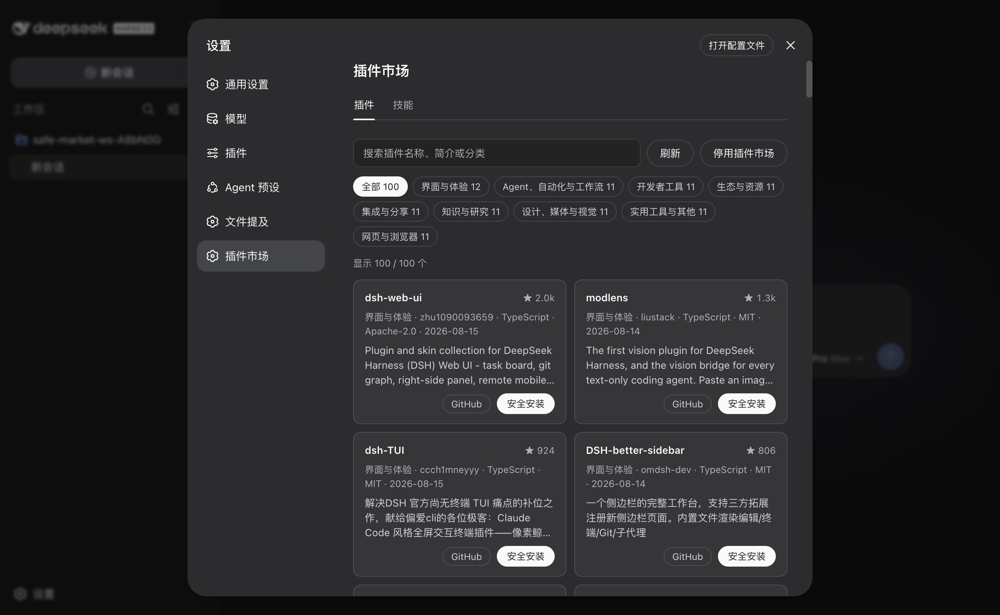
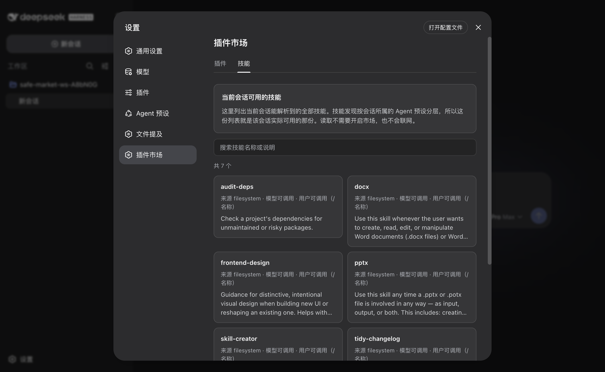

# dsh-desktop-safe-market

[English](./README.md) | 中文

给 DeepSeek Harness Web UI 加一个**先审查、再安装**的扩展市场：在设置里多一个**插件市场**导航项，分两页——

- **插件**：按分类均衡列出社区精选的 100 个插件。点「安全安装」不会替你装任何东西，而是打开一个新会话、把一段**安全审查提示词**填进输入框并关掉设置窗口，由你按回车让 Agent 先读代码、确认干净后再用官方命令安装。
- **技能**：列出当前会话实际能解析到的技能。



## 它解决什么问题

装插件本质上是在自己的机器上运行别人写的代码。社区目录能告诉你「有哪些插件」，但回答不了「这个插件安全吗」——而后者恰恰是你点安装那一刻真正在赌的东西。

这个插件把两件事接在一起：一份**已经过人工排除**的社区精选清单，和一次**由 Agent 执行的代码审查**。它自己不下载、不执行、不判断，只把请求摆到你面前。

## 安装

```sh
dsh plugin --profile web add https://github.com/bruc3van/dsh-desktop-safe-market/archive/refs/tags/v0.1.0.tar.gz
```

这条官方命令会把依赖装进 profile，并**自动把它并入 `dsh.profile.bundles`**（凡是声明了 `dsh.bundle` 的依赖都会自动入列），不需要手工改 `package.json`。装完重启 `dsh web`（或桌面客户端）即可。

浏览器、CLI 与桌面客户端共用同一个 profile，因此三处都会出现这个导航项。

## 首次使用要手动开启

「插件」页默认是**关闭**状态，只显示一张说明卡片和一个「启用插件市场」按钮。

这是刻意的：**开启才会让本机去 GitHub 读取目录快照**，关闭时插件不发起任何网络请求。一个装上就开始联网的插件，等于替你做了决定。开关是插件自己的持久化设置，开一次之后一直有效。

## 「安全安装」做了什么

1. 在当前会话所属工作区（没有则用最近使用的工作区）连接一个新会话并跳转过去；
2. 把审查提示词**填入输入框**——不发送；
3. 关闭设置窗口，让你直接看到那个会话。

提示词要求 Agent：实际读仓库代码而非只看 README，重点检查凭据/token 访问、向第三方外传数据、远程代码执行、`postinstall` 等安装脚本、无对应源码的混淆文件，以及权限是否远超其声称的功能；**发现可疑处必须停下来说明原因并询问你**；确认干净后用官方命令安装：

```sh
dsh plugin --profile web add <该仓库的 tarball 地址>
```

tarball 优先取最新 release tag，没有 release 则退回默认分支（分支名来自目录数据）。提示词里也写明了装完需要重启 dsh 才会生效。

发不发送由你按回车决定。没有任何工作区时，卡片会直接告诉你先去侧边栏选一个。

## 技能页

列出**当前会话**能解析到的技能，含名称、说明、来源 provider 与调用策略（模型可调用 / 用户 `/名称` 可调用），可搜索。

按会话寻址不是偷懒，是必须：技能注册表是「宿主 + 每作用域」分层的，而 web 部署**特意禁用了宿主平面的 `skill-filesystem`**——本地发现归各个 Agent 预设所有。从插件根上下文读只能看到全局层，会对着一堆技能报告「没有技能」。没有打开的会话时，页面直说没有可读的那一层。



## 数据来源

[awesome-dsh-plugin](https://github.com/bruc3van/awesome-dsh-plugin) 的每日快照：

- `repositories.json` —— 带 `dsh-plugin` 标签的仓库爬取结果（含分类、star、许可证、最近推送时间）；
- `curated.json` —— 人工排除名单（竞品目录站、star 不属于该插件的产品仓库等）。

**两份必须一起读**：爬取结果里没有应用排除名单，只读第一份会让一个竞品目录站排在你的市场首位。归档仓库同样被剔除。

选人规则不是纯按 star 排序——那样两三个分类就会吃掉几乎所有席位。这里按分类**轮流发牌**：每个分类先放出自己最强的一个，再放第二个，直到 100 席满；最终展示时再按 star 排序，所以列表读起来仍然像一张榜单。

## 配置

在 `~/.dsh/profiles/web/cordis.patch.yml` 里覆盖：

| 字段 | 默认值 | 说明 |
| --- | --- | --- |
| `catalogBase` | awesome-dsh-plugin 的 `data/` 目录 | 换成你自己的目录来源 |
| `marketSize` | `100` | 市场展示多少个插件 |

## 安全边界

- **插件自身不执行任何安装命令**，也没有能执行它的接口——审查与安装因此不可分割；
- **目录在 Host 侧读取并裁剪**后才发给浏览器（约 100 行，而不是 2.4 MB 快照），并持久化在 `$DSH_HOME/storages/safe_market.json`，重启后走 ETag 条件请求；
- **仓库链接由 `owner/name` 重新拼装**，不采信快照里的地址，因此被投毒的快照无法塞进自己的 URL scheme；
- 卡片全部以纯文本渲染；
- 关闭状态下 Remote 接口直接拒绝，无法绕过开关读取目录；
- 安装交接全程走官方公开服务（workspaces / sessions / conversation），不读 DOM、不发送消息。

**收录不代表安全背书。** Agent 的审查是一次有依据的辅助判断，不是结论——请自己看过再决定。

## 已知限制

- **只读技能，还不能装技能**：技能页目前只回答「我有什么」。技能的分发形态与插件不同（文件系统目录而非 npm 包），装技能是下一步。
- **不检查已安装插件**：这里只处理「装之前」，不体检已经装上的东西。
- **市场自己不执行安装**：命令写在提示词里由 Agent 执行，所以审查与安装绑在一起、绕不过去；代价是市场里看不到安装进度。

## 开发

```sh
pnpm install --ignore-workspace
pnpm run typecheck
pnpm run build      # lib/index.js（Host，ESM）、lib/client.js（浏览器，ModuleLoader 包裹）、lib/types
```

`devDependencies` 固定在与运行时一致的 `@deepseek-ai/*` 已发布版本上；`peerDependencies` 全部可选，实际由 profile 的 node_modules 提供。

## 许可证

MIT
