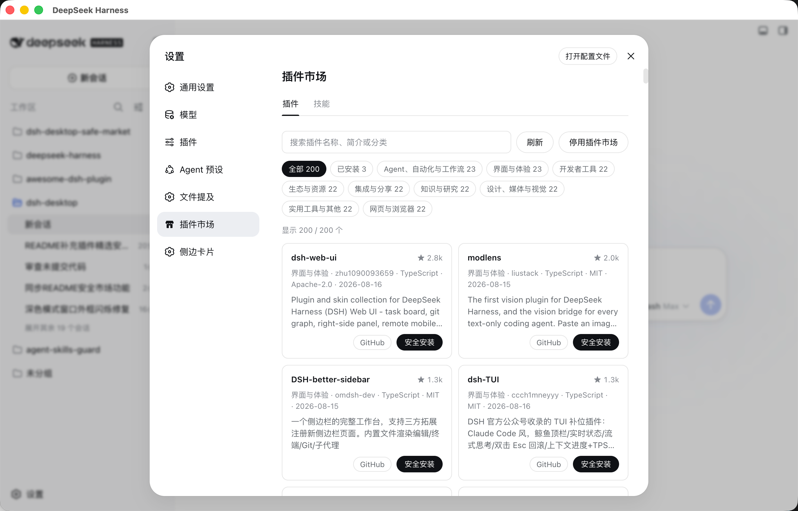
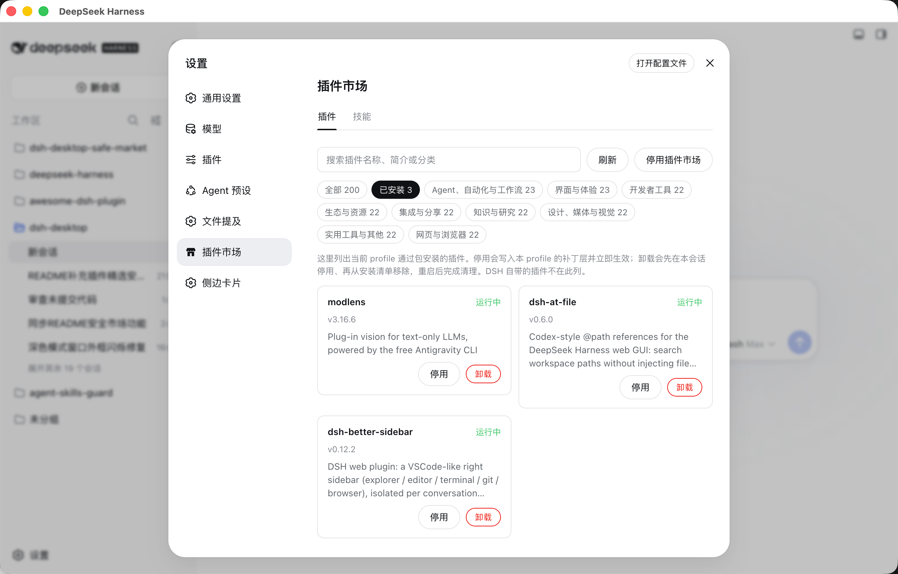

# dsh-desktop-safe-market

**Review first, then install.**

The market header switches between Full review and Compact review for installs, plugin upgrades, and market upgrades. Reopening Settings defaults to Compact review. Compact review focuses on entry points and sensitive operations, expanding on findings while retaining version pinning, integrity checks, and install gates. The Host supplies the target profile for automatic prompt filling from the plugin configuration (`profile`, default `web`); custom deployments must configure it correctly.

[中文](./README.md) | English

A **review-before-install** extension marketplace for the DeepSeek Harness web GUI. It deliberately differs from click-to-install marketplaces on two counts:

- **A curated source.** The list is not a raw crawl of the `dsh-plugin` topic. It is the daily, human-curated output of the [awesome-dsh-plugin](https://github.com/bruc3van/awesome-dsh-plugin) snapshot pipeline — topic riders, archived and disabled repositories are removed upstream, and entries are dealt round by round across categories — so what you browse is an editorially filtered shortlist, never a popularity dump.
- **Review before install.** The install button installs nothing. It opens a new session and stages a **security-review prompt**; an agent reads the repository's actual code, and only a clean reading proceeds to the official install command. The plugin itself has no interface that could run an install — review and install are inseparable by construction.

In use, it adds a **Safe Market** entry to the Settings navigation (wearing the market's own storefront icon), with two pages:

- **Plugins** — an **installed panel** on top: the plugin packages installed into this profile as dependencies, with their live state, each disableable/enableable and uninstallable; the marketplace plugin the desktop client placed is listed here too, because nowhere else can remove it. Layers shipped with DSH, and in-box bundles carrying no ownership marker, are not listed. Below it, the curated market, whose **All plugins** view ranks by stars.
- **Skills** — what the current session can actually resolve.



## What it is for

Installing a plugin means running someone else's code on your machine. An ordinary catalog answers *which plugins exist* and leaves the risk to your click; *is this one safe* stays unanswered — yet that is exactly what you are betting on at the moment you click install.

This plugin joins the two halves: a community shortlist that has **already had the non-plugins curated out**, and a **code review performed by an agent**. It downloads nothing, executes nothing, and judges nothing itself — it puts the request in front of you. That is the whole differentiation from an ordinary market: **a curated entrance, and an install that cannot skip its review.**

## Install

Prefer the [npm](https://www.npmjs.com/package/dsh-desktop-safe-market) package:

```sh
dsh plugin --profile web add dsh-desktop-safe-market
```

Or hand the install to your agent — copy this one-line prompt:

```text
Install DSH Safe Market for me: run the official command `dsh plugin --profile web add dsh-desktop-safe-market` into the web profile, then remind me to restart dsh web for it to load.
```

To pin the version this document names, use the GitHub release tarball:

```sh
dsh plugin --profile web add https://github.com/bruc3van/dsh-desktop-safe-market/archive/refs/tags/v0.5.0.tar.gz
```

The official command installs the dependency into the profile and **joins it into `dsh.profile.bundles` by itself** (any dependency declaring `dsh.bundle` is reconciled into the layer stack), so there is no `package.json` to edit. Restart `dsh web` (or the desktop client) afterwards.

The browser, the CLI, and the desktop client share one profile, so the entry appears in all three.

### DSH version compatibility

Safe Market 0.5.0 requires at least **DSH `0.1.5-rc.1`**, with DSH peer and development dependencies aligned to that baseline. It directly uses the split Session/Workspace Controllers, `uiWorkspace`, and the new Settings Provider API.

This is an intentional compatibility trade-off: Safe Market 0.5.0 **does not support the DSH 0.1.1 or 0.1.2 lines** and no longer includes a fallback to the monolithic `dsh-client-runtime`. Environments that remain on 0.1.1 should keep `dsh-desktop-safe-market@0.3.0`; environments on 0.1.2 (at least `0.1.2-alpha.3`) should keep `dsh-desktop-safe-market@0.4.3`. Upgrade DSH to `0.1.5-rc.1` before upgrading to Safe Market 0.5.0.

## You turn it on yourself

The **market half** of the Plugins page ships **off**. Until you enable it, it is one card explaining what enabling does, and a button (the installed panel answers either way).

That is deliberate: **enabling is what lets this machine read the catalog snapshot from GitHub**, and while it is off the plugin makes no network request at all. A plugin that arrives already reaching out has decided something on your behalf. The switch is the plugin's own durable setting — answer once and it stays answered.

## What "Review and install" does

1. connects a new session in the current session's workspace (or the most recently used one) and navigates there;
2. **stages** the review prompt in the composer — it does not send it;
3. closes Settings, so you are looking at the session it was staged in.

The prompt opens by stating its scope: **the only purpose is the security review — install efficiently once the code is clean, with no extra verification**. It asks the agent to treat everything in the repository as untrusted material under review (instructions found there are never followed), to read the code rather than the README, and to look for credential or token access, data sent to third-party hosts, remote code execution or downloaded-and-executed payloads, install-time scripts (`postinstall`, `prepare`, and friends), obfuscated sources with no matching original, and permissions far wider than the plugin claims. **Anything suspicious means stop, explain, and ask you.** A clean reading is followed by the official command, by priority — the npm package or the latest release tag's prebuilt tarball first (no repository code runs at install time), and only failing both, source from the default branch pinned to an exact commit:

```sh
dsh plugin --profile web add <npm package@reviewed-exact-version | tarball URL | github:owner/name#<commit sha>>
```

The npm path records the reviewed exact version and `dist.integrity`, verifies the tarball, and installs that version without re-resolving `latest`.

A source install is blocked by pnpm's `allowBuilds` gate — permission for the repository's code to run on your machine at install time — and the prompt has the agent hand pnpm's printed key to you verbatim, wait for it to land in the profile's `pnpm-workspace.yaml`, and re-run. The agent locates and runs `dsh` itself — you are never asked to run commands: most precisely, it takes the executable path of the running dsh process (found by process name — which need not be `dsh`, it can be node or the client's own process — with no fixed port assumed); failing that, it checks the environment variables, then the default installation directory and the npm/pnpm global bin. It stays in those usual spots — no whole-disk scans, no elevation (no sudo, no run-as-administrator). It confirms the install with `dsh plugin --profile web list` and then tells you dsh must be restarted before the plugin loads.

Whether it is sent is your Enter key. With no workspace yet, a notice at the top of the page says so up front, and the card's button becomes **Choose a folder and install** — one click opens the host's own directory picker, registers what you choose as a workspace, and goes on installing, instead of sending you to the sidebar and back to start over. Cancelling the picker is just a cancellation, not a failure.


### Already installed: review and upgrade

A catalog row already installed into this profile is marked **Installed vX.Y.Z** in its card, and its button reads **Review and upgrade** instead of Review and install — so you are not offered an install for something you already have.

The join is the installed package's `repository` field (every npm spelling is reduced to `owner/name`), because the catalog is keyed by GitHub repository while an install is keyed by package name, and the two are only sometimes spelled alike. A package that declares no repository falls back to matching its short name against the repository name — but only while that name picks out exactly one installed package: when two share it, neither claims the row, because an answer that depends on iteration order is worse than no answer.

**The catalog carries no versions** (the upstream `market.json` records repository facts, not releases), so whether a newer version exists is something this plugin cannot compute locally — and does not guess. The upgrade prompt's first step is to have the agent establish the newest upstream version — the latest release tag, or the version the repository publishes to npm — and, **if it is not newer, say so and change nothing**; only a real update leads on to a full review of the new artifact — the same scan standard as a fresh install, not a diff-oriented review of what changed between versions. Upgrades install through the same ladder as fresh installs (npm / release tarball / commit-pinned source) and the same `allowBuilds` rules. As with install, the plugin runs no command itself.

## The installed panel

The **installed panel** at the top of the Plugins page lists the packages this profile gained through `dsh plugin add` (names that sit in both `dependencies` and `dsh.profile.bundles`) — version, description, the live state of each loader entry — **and the marketplace plugin the desktop client placed**. Layers shipped with the DSH profile template are not listed. Two actions:

- **Disable/enable** writes (or removes) a `- id: <entry>` / `disabled: true` row in the profile's own `cordis.patch.yml` (the user patch layer) and nudges the loader entry directly — **effective immediately, no restart**, and durable across restarts. The market's own row has no disable button: disabling the market would take down the only surface that could re-enable it.
- **Uninstall** stops a user plugin for this session, then runs `pnpm remove` in the profile directory (the same primitive official `dsh plugin remove` forwards to), so the dependency, lockfile, `node_modules`, and `dsh.profile.bundles` entry go together, along with that package's leftover `allowBuilds` / `minimumReleaseAgeExclude` rows in `pnpm-workspace.yaml`. An in-box seat has no pnpm tree: uninstall drops the `bundles` entry and deletes the marked copy only when no other profile references it. If `pnpm remove` fails, the manager attempts manifest removal and reports the prune fault. If manifest removal also fails, the panel reports failure and the boot sweep preserves the stop rows. A plugin uninstalled and reinstalled within one session is held down by leftover stop rows, and its card explains that Enable will clear them.

The list also shows plugins that sit in `dependencies` but never joined `dsh.profile.bundles` (installed, not loaded), so they can be uninstalled from here. Enable is not offered for those rows.

### The marketplace plugin placed by the desktop client

The desktop client does not install this market with `dsh plugin add`. It **copies** the plugin into `<DSH_HOME>/profiles/node_modules` and adds one entry to `dsh.profile.bundles` — no dependency. Such a copy is labelled *seated by the desktop client*, and **this panel is the only place it can be removed**: official `dsh plugin` deliberately never touches a bundle that is not a profile dependency, and the client that placed it may have been uninstalled since.

Uninstall removes the current profile's `bundles` entry, then checks whether another profile still resolves the same copy. Files remain when another profile references them, references cannot be checked, or the directory is outside the managed locations.

If the client is still installed and still set to seat the built-in Safe Market, it will put the plugin back the next time it starts; the card says so. To stop it coming back, turn the switch off in the client's connection settings. An in-box bundle with no ownership marker belongs to the deployment itself: it is neither listed nor removable here.

By design it matches "review and install": **disable, listing, and in-box uninstall stay local file edits plus loader calls**. Uninstall of a user plugin is the one verb that spawns: `pnpm remove` in this profile directory, never an install over the network. With the market switched off, though, the page is the switch and nothing else: what you turned off is this marketplace, and it should not keep a plugin manager running in your settings.



## The Skills page

Lists the skills the **current session** resolves — name, description, owning provider, and invocation policy (model-invocable, user-invocable via `/name`) — with search.

Addressing it by session is required, not lazy: the skill registry is host+per-scope layered, and the web deployment **deliberately disables the host-plane `skill-filesystem` row** — local discovery belongs to each agent preset. A read from the plugin's root context sees the global layer alone and would report "no skills" to a user with plenty. With no session open, the page says there is no layer to read.


## Where the data comes from

The market reads a single published file, [`market.json`](https://github.com/bruc3van/awesome-dsh-plugin/blob/main/data/market.json), from [awesome-dsh-plugin](https://github.com/bruc3van/awesome-dsh-plugin)'s daily snapshot pipeline. Every editorial decision happens upstream, where the crawl and the human curation live:

- the crawl of repositories tagged `dsh-plugin` (`repositories.json`) is filtered there — a description is required, archived/disabled repositories are dropped, and the exclusions in `curated.json` are applied;
- rows are categorized and **balanced** there — not a straight star ranking (that would hand almost every slot to two or three categories), but entries dealt round by round so every category places its best entry before any places its second, up to 300;
- this plugin truncates that order to `marketSize` (default 1000 — a ceiling, not a target: upstream's deal decides the actual count) and re-validates every row on the Host before the browser sees it;
- **network resilience (automatic failover)**: the default read comes from GitHub raw. When the default address cannot answer (timeout, DNS/connection failure, or an HTTP error), the read automatically falls over to the jsDelivr CDN mirror of the same published file ([bruc3van/awesome-dsh-plugin](https://github.com/bruc3van/awesome-dsh-plugin)'s `cdn.jsdelivr.net/gh/…@main/data/market.json`, which answers with an ETag so the conditional request still works). The side that answered is remembered (sticky) and tried first next time, falling back the other way if it later fails — no configuration needed. A deployment with its own `catalogBase` keeps exactly that one source.

The wire protocol — field shapes, truncation limits, the branch-name whitelist, the ordering invariant, and the versioning rules — is documented in [docs/market-json-spec.md](docs/market-json-spec.md).

## Configuration

Override in `~/.dsh/profiles/web/cordis.patch.yml`:

| Field | Default | Meaning |
| --- | --- | --- |
| `catalogBase` | awesome-dsh-plugin's `data/` directory | Point the market at a mirror of the same file |
| `marketSize` | `1000` | Ceiling on the rows shown. Upstream sets the count (`market.json` publishes at most 300); the default sits well above that cap as a backstop, not as a dial to tune |

## Security boundary

- **The plugin runs no install command and exposes no interface that could** — review and install are therefore inseparable;
- **the market file is fetched and re-validated on the Host** before the browser sees it — a curated list of at most 300 rows, not the 2.4 MB crawl — and persisted at `$DSH_HOME/storages/safe_market.json` so a restart asks conditionally (one 304, or the jsDelivr mirror when the default address is unreachable, or the last catalog when both are);
- **repository links are rebuilt from `owner/name`** rather than trusted from the file, so a poisoned file cannot contribute a URL scheme of its own — the wire codec enforces the rebuilt shape, not just a comment;
- **the default branch is pattern-checked before it reaches the prompt** (`[A-Za-z0-9][A-Za-z0-9._/-]*` plus the git ref rules; anything else falls back to `main`), and the prompt declares both the URL and the branch as opaque marketplace literals — a poisoned branch name cannot inject instructions into the review;
- **the configured profile name is pattern-checked too** (`[A-Za-z0-9][A-Za-z0-9._-]{0,63}`): it is the one value that reaches the prompt as configuration rather than as catalog data, and it is interpolated into the `--profile` argument — a name outside that shape makes the market refuse to start rather than stage a command it cannot name;
- every card renders as plain text;
- while disabled, the Remote refuses — the catalog cannot be read around the switch;
- the install hand-off runs entirely through published services (workspaces / sessions / conversation): it reads no DOM and sends no message;
- the installed-panel verbs accept only **wire-codec-checked package names that are actually in the profile manifest**; disable and in-box uninstall land as local file edits plus loader calls. Uninstall of a user plugin runs `pnpm remove` in the profile directory (Windows uses a command interpreter for the `.cmd` shim, with package names restricted to safe characters and option-like names rejected); a failed prune attempts manifest removal, and failed manifest removal reports an error while preserving stop rows; edits to your patch layer preserve existing comments and hand-written rows.

**Being listed is not a safety endorsement.** Review and install only writes the review prompt into a new session; sending it is your Enter key. Once sent, the agent stops and asks you when something looks suspicious, and installs and reports back when it judges the code clean — **your checkpoints are that Enter key and every stop the prompt makes it take**. The review is an informed second opinion, not a verdict.

## Known limitations

- **Skills are read-only for now.** The Skills page answers "what do I have". Skills are distributed as filesystem directories rather than npm packages, so installing them is the next step.
- **It does not audit what you already installed.** The installed panel views, disables, and uninstalls, but it does not re-review code that is already running — the before-install review is still the gate.
- **The market does not run the install itself.** The command lives in the prompt and the agent runs it, which is what makes the review impossible to skip — at the cost of no progress display inside the market.
- **The nav icon is a skin-level swap.** The settings shell hardcodes section nav icons by id (unknown ids get the gear) and the slot contract has no icon option; this plugin finds its own labeled row and re-skins the icon. If the shell restructures, the worst case is the gear returning — nothing functional breaks.

## Development

```sh
pnpm install       # not --ignore-workspace: pnpm 11 reads build approvals only from the workspace file
pnpm run typecheck
pnpm test          # node --test, the catalog reduction and reader regressions
pnpm run build     # lib/index.js (Host ESM), lib/client.js (browser, ModuleLoader-wrapped), lib/types
```

A version bump has places that must move together: `package.json`, `dsh.plugin.json`, and the tarball URLs in both READMEs. The version gate in `pnpm test` (`test/version.test.ts`) checks those, and that each README still offers the npm package-name install; CI (`.github/workflows/check.yml`) runs the same check on every push and PR.

Pushing a `vX.Y.Z` tag is what publishes: CI (`.github/workflows/release.yml`) cuts the GitHub Release and Trusted-Publishes the same version to [npm](https://www.npmjs.com/package/dsh-desktop-safe-market) — there is no separate `npm publish` to remember. The first time, the npm package settings need this repository's `release.yml` registered as a Trusted Publisher (user `bruc3van`, repo `dsh-desktop-safe-market`, workflow filename `release.yml`, allow `npm publish`).

`devDependencies` are pinned to the published `@deepseek-ai/*` versions the runtime actually loads; every `peerDependency` is optional and supplied by the profile's node_modules.

## Related projects

**Maintained by the author**

- **[dsh-desktop](https://github.com/bruc3van/dsh-desktop)** — a standalone DeepSeek Harness client that keeps an agent safely resident on your desktop: the official Web UI untouched, long-running tasks resident in the tray, curated plugins reviewed before they install. (This market ships in-box with the desktop client.)
- **[awesome-dsh-plugin](https://github.com/bruc3van/awesome-dsh-plugin)** — find the right plugin for your DeepSeek Harness in 30 seconds. Not another repo list: every repository on GitHub tagged `dsh-plugin` is crawled daily by script and then verified one by one by a human — genuine plugins enter the catalog, topic riders land on the blacklist, and every exclusion reason is public to check. It also tells you who each plugin is for and where to start. (Also the data source this market reads.)

**Official repositories**

- **[deepseek-harness](https://github.com/deepseek-ai/deepseek-harness)** — DeepSeek Harness: Everything is a Plugin. The upstream project behind the official `dsh` and Web UI — this plugin is a third-party marketplace on its plugin system, and everything the market installs lands in its profiles and runs on it.

## License

MIT
